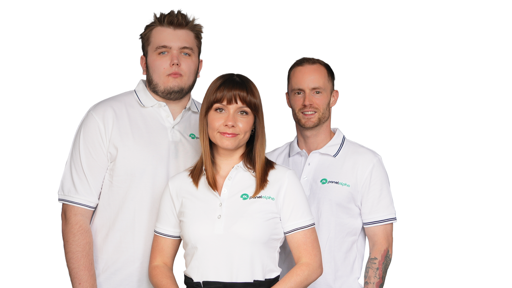

  <h1>Hey, we're PanelAlpha!</h1>
  

The way software gets made is changing fast. AI can already help you go from an idea to a working project in a fraction of the time it used to take. **We love that**. What we don't love is that putting that project on your own server can still get painfully complicated. That's the part we want to bring up to speed.

PanelAlpha began in 2021 as a WordPress management platform built for hosting providers and agencies. Today, around **8,000 active WordPress sites across more than 60 partners** run through PanelAlpha, and those years of working with real hosting infrastructure showed us how much further we could take this.

With **PanelAlpha Engine**, we're taking that experience beyond WordPress and turning it into an open source way to deploy and manage ANY application on your own VPS, with your AI assistant running it safely through controlled access.

Our GitHub is becoming the home of the pieces we want people to use, inspect, improve and build on. You'll find PanelAlpha Engine here, alongside integrations, tools, examples and other projects growing around it.

  <a href="https://www.panelalpha.com/documentation/panelalpha-engine/"><strong>Explore PanelAlpha Engine</strong></a> ·
  <a href="https://www.panelalpha.com/documentation/"><strong>Documentation</strong></a>

 

## We're building this in the open

We don't want PanelAlpha to be something we disappear into a room to build and occasionally push out into the world. We want the people using it to be close to the process, because real projects, real servers and real problems teach us far more than any test environment ever could.

So if you use Engine, you're already part of that process.

- Found a use case we haven't covered well enough? Tell us.
- Think we support something in a slightly ridiculous way? Definitely tell us.
- Need an integration we haven't thought about? Start the conversation.
- Found a bug and already know how to fix it? We like you already.

You don't have to arrive with a pull request, either. Bug reports, feature ideas, documentation fixes, questions and practical examples are all useful contributions. **The more different things people try to run on PanelAlpha, the better PanelAlpha can become for everyone.**

 

## Don't be a stranger

If you're running your own server, building with AI, working on an open source project, running a hosting business, or simply think self-hosting deserves to be much easier, you're in the right place.

 

  

 

**Discord is the main place to talk to us**. Ask questions, show us what you're building, share an idea, get help, or simply follow what we're working on. We're close to the code, close to the product and close to the community around it, so what you bring there genuinely makes its way back into what we build.

Not much of a Discord person? The <a href="https://community.panelalpha.com">forum</a> is always open too.

And we're so glad you found us. ❤️
